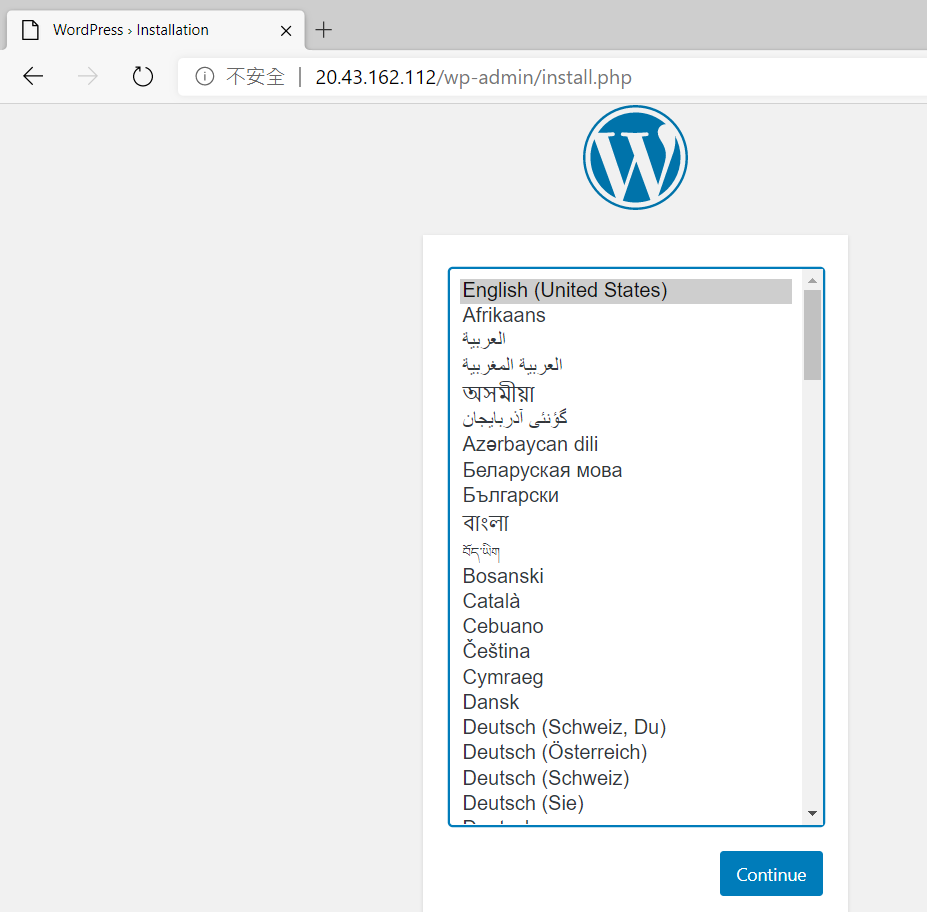

# Docker Desktop for Windows 與 Azure Kubernetes Service 實機操作

## Lab 8 部署使用 Persistent Volume Claim 的 Wordpress 與 MySQL 至 Azure Kubernetes Service 叢集

1.建立一個 Kubernetes Secret 把 MySQL 密碼儲存於其中，以避免將密碼寫在 YAML 檔案內，請在命令列模式下執行以下指令建立一個名為 mysql-password 的 Secret，並且請您記住此密碼。

```powershell
kubectl create secret generic mysql-password --from-literal=password=<資料庫密碼>
```
接著鍵入以下指令
```powershell
kubectl get secret
```
如果 Secret 順利建立完成，應會顯示類似如下結果 :

| NAME                | TYPE                                | DATA | AGE |
|---------------------|-------------------------------------|------|-----|
| default-token-bfs7h | kubernetes.io/service-account-token | 3    | 55m |
| mysql-password      | Opaque                              | 1    | 18s |

2.可以利用 Lab 3 時所建立的資料夾 Wordpress，以編輯器在該資料夾內建立一個 mysql-pvc.yaml 檔案內容如下，亦可以[直接下載預先備妥之檔案使用](./Labs-08/mysql-pvc.yaml)，定義可以永續保存資料，容量 5 GB 的標準磁碟以供之後 MySQL 資料庫檔案存放使用

```yaml
apiVersion: v1
kind: PersistentVolumeClaim
metadata:
  name: mysql-volumeclaim
spec:
  accessModes:
  - ReadWriteOnce
  storageClassName: default  
  resources:
    requests:
      storage: 5Gi
```

在此 mysql-pvc.yaml 所在路徑由命令列模式下達以下指令，建立未來存放 MySQL 名為 mysql-volumeclaim 的 Persistent Volume Claim
```powershell
kubectl apply -f mysql-pvc.yaml
```

如果 mysql-volumeclaim 順利建立完成，應會顯示類似如下結果 :

| NAME              | STATUS | VOLUME                                   | CAPACITY | ACCESS MODES | STORAGECLASS | AGE   |
|-------------------|--------|------------------------------------------|----------|--------------|--------------|-------|
| mysql-volumeclaim | Bound  | pvc-e7b8fe79-2a2c-11ea-a8da-ce7288152bd7 | 5Gi      | RWO          | default      | 4m15s |

3.可以利用 Lab 3 時所建立的資料夾 Wordpress，以編輯器在該資料夾內建立一個 mysql.yaml 檔案內容如下，亦可以[直接下載預先備妥之檔案使用](./Labs-08/mysql.yaml)，此 YAML 檔案會從 [Docker Hub](https://hub.docker.com/_/mysql) 取得 MySQL 8 官方映像檔，建立 Kubernetes 的 Deployment, Pod 與 Service 物件，在 Pod 內把 MySQL 存放資料庫檔案的路徑 /var/lib/mysql 與之前建立的 mysql-volumeclaim 綁定，MySQL 系統管理員密碼需要透過環境變數設定，也從之前建立的 mysql-password Secret 內直接取出設定。此外，由於資料庫顧及安全此 Service 使用叢集內部 ClusterIP，無法在叢集之外存取 MySQL 資料庫所在的 Pod。

```yaml
---
apiVersion: apps/v1
kind: Deployment
metadata:
  name: mysql
  labels:
    app: mysql
spec:
  replicas: 1
  selector:
    matchLabels:
      app: mysql
  template:
    metadata:
      labels:
        app: mysql        
    spec:
      containers:
      - name: mysql             
        image: mysql:8          
        args:
        - "--default-authentication-plugin=mysql_native_password"
        - "--character-set-server=utf8mb4"
        - "--collation-server=utf8mb4_unicode_ci"
        env:
        - name: MYSQL_ROOT_PASSWORD
          valueFrom:
            secretKeyRef:
              name: mysql-password
              key: password
        resources:
          limits:
            memory: 512Mi
            cpu: 250m
          requests:
            cpu: 250m
            memory: 512Mi
        ports:
        - name: mysql
          containerPort: 3306                           
        volumeMounts:
        - name: mysql-persistent-storage
          mountPath: /var/lib/mysql
      volumes:
        - name: mysql-persistent-storage
          persistentVolumeClaim:
            claimName: mysql-volumeclaim

---
apiVersion: v1
kind: Service
metadata:
  name: mysql-svc
  labels:
    app: mysql
spec:
  selector:
    app: mysql
  ports:
    - port: 3306
  type: ClusterIP
```

在此 mysql.yaml 所在路徑由命令列模式下達以下指令，開始在 Kubernetes 叢集內建立 MySQL 資料庫。
```powershell
kubectl apply -f mysql.yaml
```
當相關內容順利建置完成之後，由於 mysql-svc 使用 ClusterIP 無法從外部存取測試資料庫是否正常運作，我們可以利用之前所學的技巧，得知 MySQL Pod 的名稱，鍵入以下指令將 MySQL Pod 的 3306 Port 可由 Windows 10 本機 3306 Port 轉送，下達指令前請確認目前本機 3306 Port 未被占用。

```powershell
kubectl port-forward <Pod 名稱> 3306:3306
```
成功後即可利用 Lab 2 時所使用的 MySQL 資料庫管理工具對本機 3306 Port 進行連線測試。此時畫面應類似下圖


當測試完畢無誤之後，鍵入 Ctrl-C 即可中斷 kubectl port-forward 執行。

4.可以利用 Lab 3 時所建立的資料夾 Wordpress，以編輯器在該資料夾內建立一個 wordpress-pvc.yaml 檔案內容如下，亦可以[直接下載預先備妥之檔案使用](./Labs-08/wordpress-pvc.yaml)，定義可以永續保存資料，容量 5 GB 的標準磁碟以供之後 Wordpress 檔案存放使用

```yaml
apiVersion: v1
kind: PersistentVolumeClaim
metadata:
  name: wordpress-volumeclaim
spec:
  accessModes:
  - ReadWriteOnce
  storageClassName: default
  resources:
    requests:
      storage: 5Gi
```
在此 wordpress-pvc.yaml 所在路徑由命令列模式下達以下指令，建立未來存放 Wordpress 名為 wordpress-volumeclaim 的 Persistent 
Volume Claim

```powershell
kubectl apply -f wordpress-pvc.yaml
```
5.接下來以編輯器在該資料夾內建立一個 wordpress.yaml 檔案內容如下，亦可以[直接下載預先備妥之檔案使用](./Labs-08/wordpress.yaml)，此 YAML 檔案會從 [Docker Hub](https://hub.docker.com/_/wordpress) 取得 Wordpress 5.3 官方映像檔，建立 Kubernetes 的 Deployment, Pod 與 Service 物件，在 Pod 內把 Wordpress 存放 HTML 網頁路徑 /var/www/html 與之前建立的 wordpress-volumeclaim 綁定，所搭配 MySQL 連線位置需要透過環境變數 WORDPRESS_DB_HOST 設定，此環境變數我們指定了之前所建立的 MySQL Service 名稱 mysql-svc:3306 ，而 Wordpress Service 則建立 LoadBalancer 類型以提供 Public IP Address 以便外部連線存取使用。

```yaml
---
apiVersion: apps/v1
kind: Deployment
metadata:
  name: wordpress
  labels:
    app: wordpress
spec:
  replicas: 1
  selector:
    matchLabels:
      app: wordpress
  template:
    metadata:
      labels:
        app: wordpress
    spec:
      containers:
        - image: wordpress:5.3
          name: wordpress
          env:
          - name: WORDPRESS_DB_HOST
            value: mysql-svc:3306
          - name: WORDPRESS_DB_PASSWORD
            valueFrom:
              secretKeyRef:
                name: mysql-password
                key: password
          resources:
            limits:
              memory: 256Mi
              cpu: 250m
            requests:
              cpu: 250m
              memory: 256Mi
          ports:
            - containerPort: 80
              name: wordpress
          volumeMounts:
            - name: wordpress-persistent-storage
              mountPath: /var/www/html
      volumes:
        - name: wordpress-persistent-storage
          persistentVolumeClaim:
            claimName: wordpress-volumeclaim
---
apiVersion: v1
kind: Service
metadata:
  name: wordpress-svc
  labels:
    app: wordpress
spec:  
  selector:
    app: wordpress
  ports:
    - port: 80
      targetPort: 80
      protocol: TCP  
  type: LoadBalancer
```
在此 wordpress.yaml 所在路徑由命令列模式下達以下指令，開始在 Kubernetes 叢集內建立 Wordpress。
```powershell
kubectl apply -f wordpress.yaml
```
鍵入以下指令
```powershell
kubectl get svc
```
則可顯示目前 Service 建立狀況，由於此 wordpress.yaml 定義要建立一個具備負載平衡器的 Service，因此 Microsoft Azure 必須配置一個對外公開的 IP Address 給此負載平衡器，因此需要花費數分鐘的時間，當負載平衡器順利建立完成，應會顯示類似如下結果 :

| NAME           | TYPE         | CLUSTER-IP  | EXTERNAL-IP  | PORT(S)      | AGE |
|----------------|--------------|-------------|--------------|--------------|-----|
| kubernetes     | ClusterIP    | 10.0.0.1    | \<none>      | 443/TCP      | 52m |
| mysql-svc      | ClusterIP    | 10.0.106.192| \<none>      | 3306/TCP     | 11m |
| wordpress-svc  | LoadBalancer | 10.0.5.1    | 20.43.162.112|80:30135/TCP  | 3m  |


以瀏覽器連接依據配發的外部 IP Address 即可 Wordpress 首次執行安裝畫面



* [刪除所建立的 Azure 資源群組](Labs-clear.md)
* [返回 README](README.md)